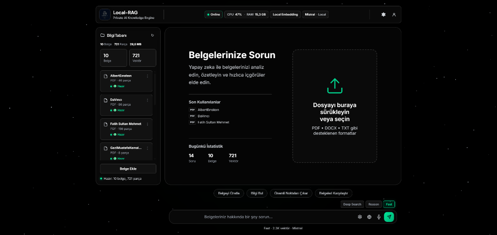
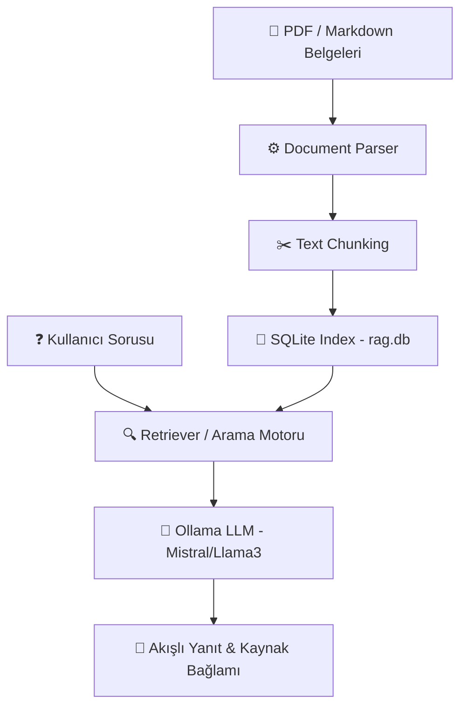

# Local RAG Assistant

<div align="center">

  

  <br><br>

  **Tamamen offline çalışan kişisel yapay zeka belge asistanı**

  PDF ve Markdown dosyalarınızla konuşun.  
  Verileriniz cihazınızdan çıkmaz.

</div>

---

## Genel Bakış

Local RAG Assistant, kişisel veya kurumsal belgeleriniz (PDF, Markdown) üzerinden tamamen çevrimdışı (offline) soru-cevap yapmanızı sağlayan yerel bir RAG (Retrieval-Augmented Generation) uygulamasıdır. 

Verileriniz hiçbir dış sunucuya gönderilmez; tüm metin parçalama, indeksleme ve vektör arama işlemleri yerel bilgisayarınızda gerçekleşir.

---

## Gizlilik ve Güvenlik

Projenin en temel odak noktası tam veri gizliliği ve güvenliğidir:

- ❌ **Bulut API Kullanmaz:** OpenAI, Anthropic veya başka bir dış bulut servisine istek atmaz.
- ❌ **Harici Sunucuya Veri Göndermez:** Yüklediğiniz belgeler veya sorularınız cihazınızdan dışarı çıkmaz.
- ❌ **Telemetri ve Takip Yoktur:** Belge içerikleriniz veya kullanım verileriniz asla kaydedilmez ya da toplanmaz.

✔ **Tüm işlemler %100 yerel bilgisayarınızda gerçekleşir.**

---

## RAG Çalışma Mimarisi

```text
[ PDF / Markdown Belgeleri ]
           │
           ▼
  [ Document Parser ]      ── (pdf-parse / fs)
           │
           ▼
   [ Text Chunking ]       ── (Metin parçalama & temizleme)
           │
           ▼
   [ SQLite Index ]        ── (rag.db / Türkçe Kök-Ek İndeksi)
           │
 ──────────┼────────── (Soru & Arama Akışı)
           │
   [ User Question ]       ── (Kullanıcı Sorusu)
           │
           ▼
    [ Retriever ]          ── (İlgili Bağlam Çıkarımı)
           │
           ▼
   [ Ollama LLM ]          ── (Mistral / Llama3 Yerel Model)
           │
           ▼
[ Akışlı Yanıt (SSE) + Kaynak Bağlamı ]
```

<details>
<summary><b>📐 Görsel Akış Şeması (Mermaid)</b></summary>



</details>

---

## Özellikler

- ✅ **%100 Çevrimdışı (Offline) Çalışma:** İnternet bağlantısı gerektirmez, verileriniz cihazınızdan dışarı çıkmaz.
- ✅ **Harici API Anahtarı Gerektirmez:** OpenAI veya diğer üçüncü taraf paralı API'lere bağımlı değildir.
- ✅ **PDF ve Markdown Desteği:** Yüklediğiniz belgeleri otomatik olarak analiz eder ve indeksler.
- ✅ **Ollama ile Yerel LLM Desteği:** Mistral, Llama3 vb. açık kaynaklı yerel modelleri destekler.
- ✅ **Kaynak Gösterimli Cevaplar:** Her yanıtın altında ilgili metin bağlamını (context) ve kaynak belgeyi gösterir.
- ✅ **SQLite Tabanlı Hızlı İndeksleme:** `better-sqlite3` ile yüksek performanslı yerel vektör ve kelime araması.
- ✅ **Türkçe Karakter ve Ek Duyarlı Arama:** Türkçe kök ve ek ayıklama mekanizmasıyla doğru metin eşleştirme.
- ✅ **Canlı Akışlı Yanıt Üretimi (SSE):** Cevapları beklemeden kelime kelime anlık olarak ekrana basar.
- ✅ **Windows Tek Tık Başlatma:** `Baslat.bat` ile arka plan servislerini ve web arayüzünü otomatik açar.

---

## Desteklenen Modeller

Sistem, Ollama veya Foundry Local SDK üzerinde çalışan tüm açık kaynaklı LLM'ler ile tam uyumludur. Test edilen ve önerilen modeller:

| Model | Kullanım |
| :--- | :--- |
| **Mistral** | Genel kullanım ve Türkçe yanıt başarım dengesi |
| **Llama 3** | Daha detaylı ve mantıksal açıdan kaliteli cevaplar |
| **Phi-3** | Düşük donanım ve kısıtlı RAM kapasitesi |
| **Gemma** | Hızlı yanıt ve hafif kullanım |

---

## Sistem Gereksinimleri

Yerel yapay zeka modellerini akıcı bir şekilde çalıştırabilmeniz için gereken bilgisayar donanım özellikleri:

| Donanım | Minimum | Önerilen |
| :--- | :--- | :--- |
| **RAM (Bellek)** | 8 GB | 16 GB veya üzeri |
| **İşlemci (CPU)** | 4 Çekirdekli CPU | 8+ Çekirdekli modern CPU |
| **Ekran Kartı (GPU)** | Entegre (CPU modunda çalışabilir) | NVIDIA CUDA (4GB+ VRAM) veya Apple Silicon |
| **Depolama** | 5 GB boş alan (HDD) | SSD (Hızlı model yükleme için) |

---

## Mimari ve Teknolojiler

- **Backend:** Node.js, Express.js
- **Veritabanı / İndeksleme:** SQLite (`better-sqlite3`) — Türkçe kök ve ek duyarlı metin arama algoritması
- **LLM Entegrasyonu:** Ollama API (`mistral`, `llama3` vb.) & Foundry Local SDK desteği
- **İletişim Protokolü:** SSE (Server-Sent Events) ile canlı akışlı (streaming) yanıt üretimi
- **Frontend:** Vanilla JavaScript, HTML5, CSS3

---

## Ön Gereksinimler

Sistemi çalıştırmadan önce bilgisayarınızda aşağıdaki yazılımların kurulu olması gerekir:

1. **[Node.js](https://nodejs.org/)** (v16.0.0 veya üstü)
2. **[Ollama](https://ollama.ai/)**
   - Ollama'yı kurduktan sonra kullanmak istediğiniz dili/modeli indirin:
     ```bash
     ollama pull mistral
     ```

---

## Kurulum

1. Depoyu klonlayın veya indirin:
   ```bash
   git clone https://github.com/mert-carli/LocalRagProject.git
   cd LocalRagProject
   ```

2. Proje bağımlılıklarını yükleyin:
   ```bash
   npm install
   ```

---

## Çalıştırma

### Yöntem 1: Otomatik Başlatıcı (Windows)
Klasör içerisinde yer alan **`Baslat.bat`** dosyasına çift tıklayın. 
Script arka planda Ollama servisini kontrol edecek, web sunucusunu başlatacak ve sistem tam hazır olduğunda varsayılan tarayıcınızı otomatik olarak açacaktır.

### Yöntem 2: Terminal Üzerinden
Terminal veya Komut İstemi'nde aşağıdaki komutu çalıştırın:
```bash
npm start
```
Sunucu başlatıldıktan sonra tarayıcınızdan **`http://localhost:3000`** adresine gidin.

---

## Kullanım

1. **Belge Yükleme:** Sol panelden PDF veya Markdown formatındaki belgenizi yükleyin. Sistem belgeyi otomatik olarak küçük parçalara (chunks) bölüp yerel veritabanına indeksler.
2. **Soru Sorma:** Yüklediğiniz belgelerin içeriğiyle ilgili sorularınızı yazın.
3. **Kaynak Doğrulama:** Cevapların altında gösterilen *Kullanılan Kaynak Bağlamı* alanından yanıtın belgenin hangi bölümünden çıkarıldığını doğrulayabilirsiniz.

---

## Proje Yapısı

```text
LocalRagProject/
├── assets/              # README görselleri ve ekran görüntüleri
├── database/            # SQLite veritabanı dosyası (rag.db)
├── docs/                # İndekslenecek belgeler (PDF/MD)
├── public/              # Web arayüzü dosyaları (HTML, CSS, JS)
├── src/
│   ├── server.js        # Express web sunucusu ve SSE yayın hattı
│   ├── vectorStore.js   # Metin parçalama ve SQLite arama motoru
│   ├── rag.js           # RAG bağlam üretici
│   └── prompts.js       # Sistem istemi (System prompt)
├── Baslat.bat           # Windows tek tıkla başlatıcı
├── package.json
└── README.md
```

---

## Lisans

ISC
